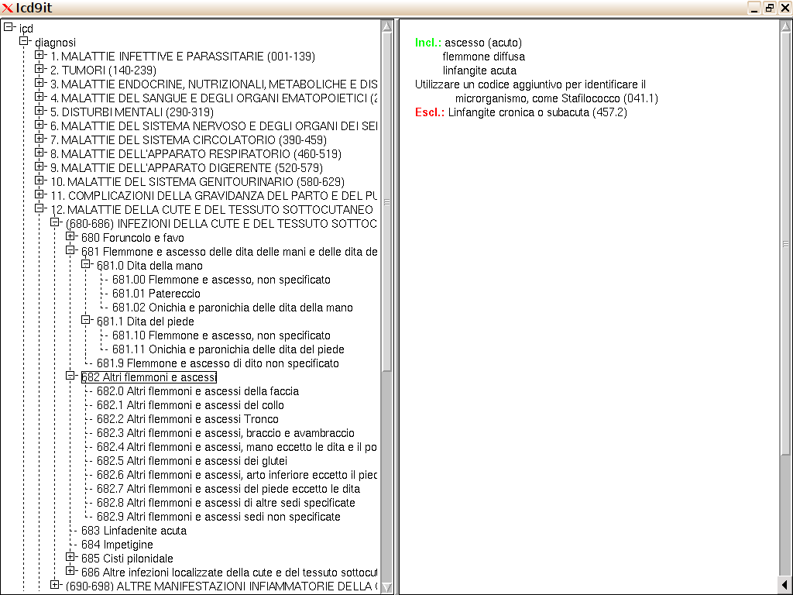
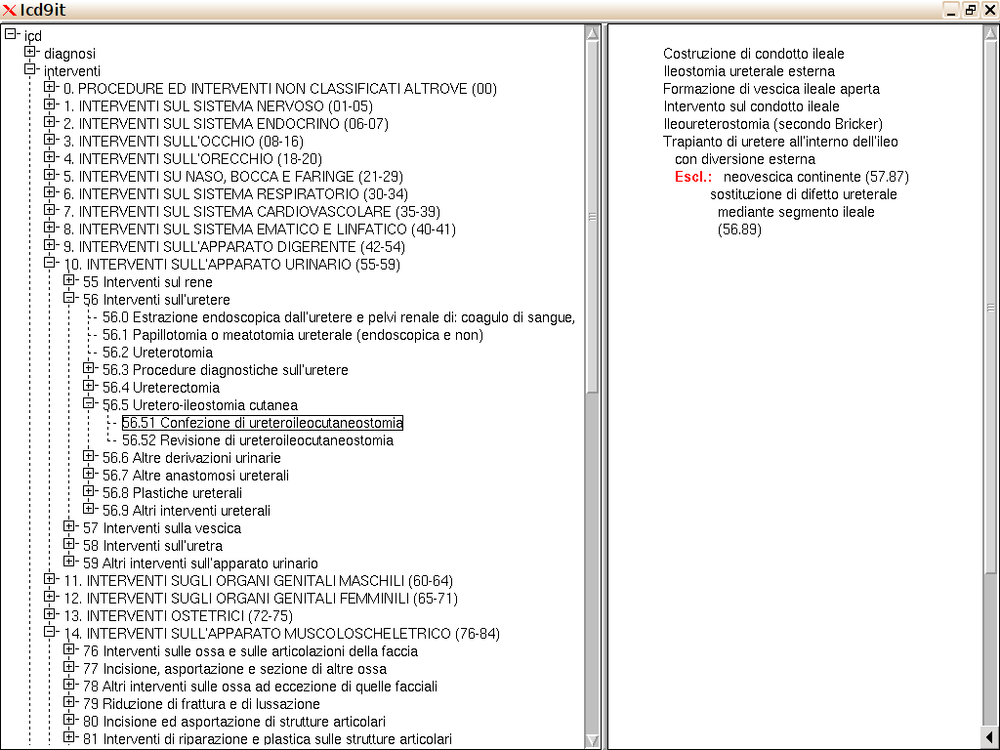

treeview italian icd codes with comments

```
(icd9it-clim:icd-clim)
```


data.gz converted from pdf files available on the net, e.g.

[here](http://www.salute.gov.it/portale/documentazione/p6_2_2_1.jsp?lingua=italiano&id=2251)
or
[here](http://www.regione.piemonte.it/sanita/area_operatori/dwd/icd9cm2007/icd9cm2007/home.htm)

see icd9it-pdf

```
; unzip data
(deoxybyte-gzip:gunzip "data.gz" "DatatreeClimIcd9it.lisp") 
```

screenshots





